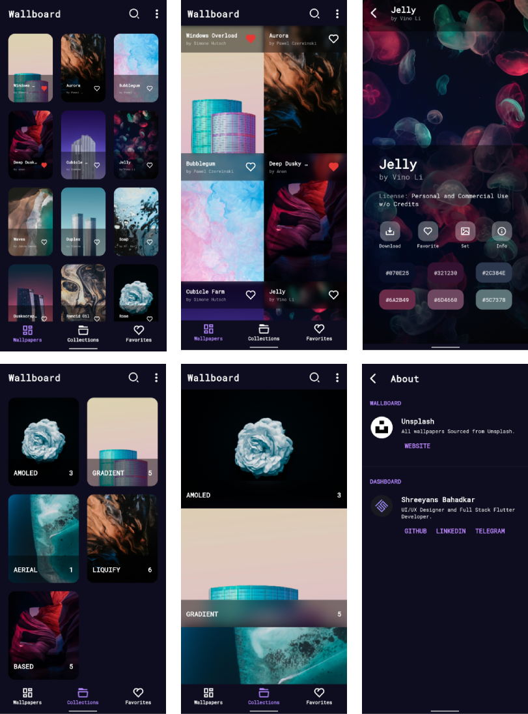

Wallboard
======
Beautiful, Free, Customizable Wallpaper Dashboard app made with Flutter.

## Preview

<p align="center">
  
</p>
<p align="center">
  
</p>

## How to Use
### 1. Clone the source code
```terminal
git clone https://github.com/ShreeyansB/wallboard.git
```
### 2. Set Basic App Values
#### Change the app name in the following files: 

*- wallboard/android/app/src/main/AndroidManifest.xml*<br>
*- wallboard/ios/Runner/Info.plist*

#### Change the package name by running:
```
flutter pub run change_app_package_name:main com.new.package.name
```
#### Set the app version by editing:
*- wallboard/pubspec.yaml*

### 3. Set App Icons and Splash Screen
#### App Icon
App icon can be updated by replacing the icon images with your own in the *wallboard/android* and *wallboard/ios* directories manually or by using a site like [this](https://easyappicon.com/).

#### Splash Screen
To change the splash image on the splash screen, replace the image at - *wallboard/assets/splash.png* with your own.
To change the background colors and more tweaks follow edit the file at - *wallboard/flutter_native_splash.yaml* (instructions in file)
Then run the following commands: 
```
flutter pub get
flutter pub run flutter_native_splash:create
```
### 4. Add Wallpapers and customize App UI
__Edit the variables in *wallboard/lib/dev_settings.dart* according to your liking.__<br>
__Instructions and Hints about the variables provided in file.__

While setting up the JSON for the wallpapers, follow the given reference: 
|      Key     | Required | Data Type |           Description           |
|:------------:|:--------:|:---------:|:-------------------------------:|
| name         | Yes      | String    | Wallpaper Name                  |
| url          | Yes      | String    | Wallpaper Image URL             |
| author       | No       | String    | Wallpaper Author Name           |
| thumbnail    | No       | String    | Thumbnail Image                 |
| collection   | No       | String    | Single Collection to Include In |
| downloadable | No       | Boolean   | Allow Wallpaper download        |
| size         | No       | String    | File Size                       |
| dimensions   | No       | String    | Image Dimensions                |
| license      | No       | String    | Licensing Information           |

[Example JSON](https://api.jsonbin.io/b/61052fea046287097ea3f7c6/latest)

### 5. Add Credits for About Screen

__Add your credits in *wallboard/assets/credits.json*.__
Check the already written JSON for the JSON Model.

## Still need help?
Contact me on [Telegram](https://t.me/ballisticswami) if you need assistance.

## Planned Features
* One Signal Notifications (Done)
* Language Support
* iOS Support
